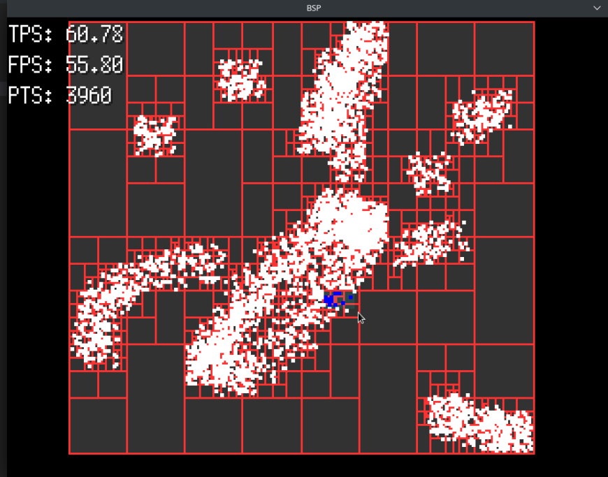
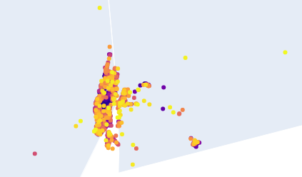

# Concurrent DBSCAN GO

This is a simple implementation of the [DBSCAN algorithm](https://en.wikipedia.org/wiki/DBSCAN)
That uses binary space partitioning to speed up neighborhood search.

[](https://asciinema.org/a/VO2BaDVczne5g3Tb2fss30Uqn)

## How to run

Usage: `./dbscan <input_file> <epsilon> <minPts> <maxJobSize> <threadN>`
The arguments default to:
`./dbscan data.csv 0.0003 5 1000 [number of cpu cores on your computer]`

## Visualizing the results

The program will output 2 files called `clusters.csv` and `points.csv`.
You can use a tool such as [Google My Maps](https://www.google.com/maps/d/u/0/) or the included `visualize.ipynb` notebook to visualize the clusters (requires `jupyter`, `python`, `pandas`, and `plotty`)

## About the space partitioning

The program uses binary space partitioning to speed up neighborhood search by dividing the data into a grid of cells. This is similar to a [QuadTree](https://en.wikipedia.org/wiki/Quadtree) but with only 2 children per node.


This allow us to query all neighbors in `n log n` time instead of `n^2` time.



Example demonstrating the use of binary space partitioning.
We don't need to check for all the points, we only need to check the points inside certain rectangles.

### Building the tree

- Given a set of points, get the bounding box of the points (that will be the root of the tree)
- For each point we add, if a tree node is empty and it has not been subdivided
  - set the value of the node to the point.
- Else if, it has not been subdivided:
  - We subdivide the tree into 2 sub-trees taking the width/height ratio into account to know if we should split vertically or horizontally.
  - Add the current point and the new point to the correct sub-tree (notice the recursive call)
- Else, we have already subdivided the tree, so we add the point to the correct sub-tree (notice the recursive call for tree traversal)

## About the algorithm

- Load the data
- Transform the data into a BSP tree
- Create N worker threads to process clusters in parallel
- Given a maximum job size, divide the data into jobs until it satisfies the constraints
- The N workers will process X jobs until there are no more jobs to process
- In the meantime, the main thread will collect the results from the workers
- After all the workers have finished, the main thread will merge the results (single threaded/doesn't take advantage of the tree structure)
- The program will output the clusters and points to two csv files

## Results



With the settings:

```sh
Input file: ./data.csv
Epsilon: 0.0003
MinPts: 5
MaxJobSize: 5000
ThreadN: 12
```

I managed to find ~600 clusters in 15 seconds.
The merge process takes a lot longer, about 30 seconds, but it's not part of the assessment.
Which lowered it down to ~500 clusters.

Lowering the max job size improves the performance significantly at the cost of precision.
With a maxJobSize of 1000 I managed to find ~1000 clusters in about 2s. This is a huge improvement.
Merging took 40 seconds, 10 seconds slower than previously.

The algorithm is by no means perfect, but it improves the clustering speed significantly compared to the region based approach. Unfortunately, the merge process is a a bit buggy and not parallelized.

